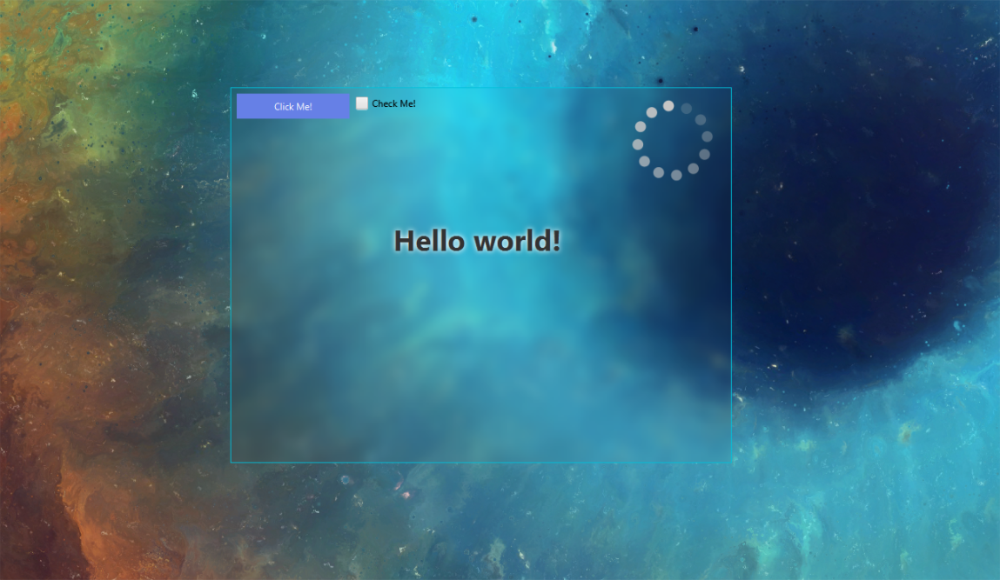

# dnwbu
[](https://github.com/Rebzzel/Universal-D3D11-Hook/releases)
[](https://github.com/Rebzzel/dnwbu/blob/master/LICENSE)

## What is dnwbu?
This utility blurs the windows (helpful for designers).



## How this works?
**DevelNext Window Blur Utility** uses win7 and win10 APIs for blur windows backgrounds.

## Fetures
 - Blur Win7 windows.
 - Blur Win10 windows.
 - Automatically gets the windows version and blurs the window.

## What you need?
[**DevelNext**](develnext.org)

[**DFFI**](https://github.com/HackMemory/dn-dffi-ext)

## How to use?
[**Download latest release**](https://github.com/Rebzzel/dnwbu/releases) and add `dnwbu.dll` to project folder.
After use **DFFI** for include.

## Example
```php
<?
use system\DFFI;
use system\DFFIType;

$dnwbu = new DFFI("dnwbu");
//$dnwbu->bind("SetWindowBlur10", DFFIType::INT, [DFFIType::STRING]);
//$dnwbu->bind("SetWindowBlur7", DFFIType::INT, [DFFIType::STRING]);
$dnwbu->bind("SetWindowBlur", DFFIType::INT, [DFFIType::STRING]);

//DFFI::SetWindowBlur10("WindowName");
//DFFI::SetWindowBlur7("WindowName");
DFFI::SetWindowBlur("WindowName");
```

## Changelog
**GO TO [RELEASES FOR](https://github.com/Rebzzel/dnwbu/releases) SEE LATEST CHANGELOGS**

## Developers
[**@Rebzzel**](https://github.com/Rebzzel)

## Lisence
**dnwbu** is licensed under the MIT License, see LICENSE for more information.
